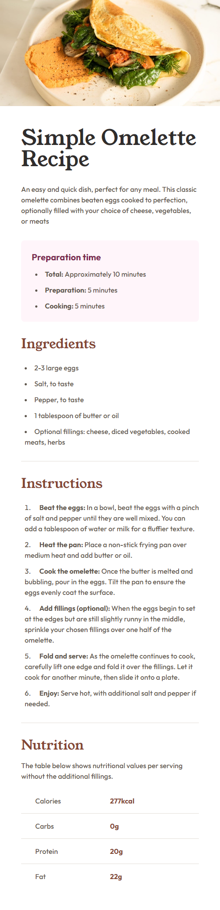
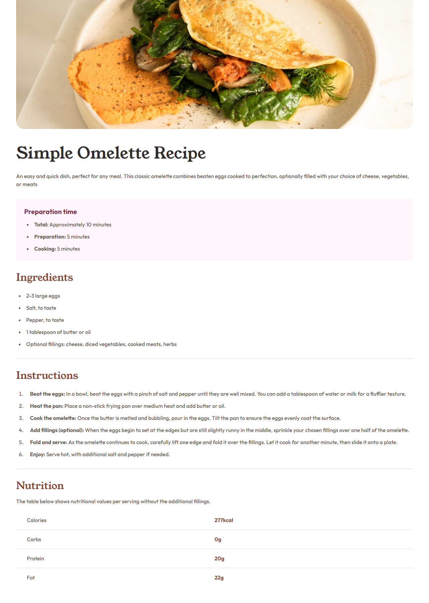

# Frontend Mentor - Recipe page solution

This is a solution to the [Recipe page challenge on Frontend Mentor](https://www.frontendmentor.io/challenges/recipe-page-KiTsR8QQKm). Frontend Mentor challenges help you improve your coding skills by building realistic projects.

## Table of contents

- [Overview](#overview)
  - [Screenshot](#screenshot)
  - [Links](#links)
- [My process](#my-process)
  - [Built with](#built-with)
  - [What I learned](#what-i-learned)
- [Author](#author)

## Overview

### Screenshots

| Mobile                                                       | Desktop                                                        |
| ------------------------------------------------------------ | -------------------------------------------------------------- |
|  |  |

### Links W.I.P.

- Solution URL: [Add solution URL here](https://your-solution-url.com)
- Live Site URL: [Add live site URL here](https://your-live-site-url.com)

## My process

### Built with

- Semantic HTML5 markup
- Mobile-first workflow
- [React](https://reactjs.org/) - JS library
- [Vite.js](https://vitejs.dev/) - React Frontend Tooling
- [Tailwind CSS](https://tailwindcss.com/) - Utility-first CSS framework

### What I learned

#### [**Stop using margin, use Spacer component instead!**](https://javascript.plainenglish.io/stop-using-margin-use-spacer-component-instead-953d9b2dbacc)

When coding for UI layout, we need something to represent the spacing between elements, and yes, we have been using margin for a long time.

However, when using a component-based framework such as React, we may need to rethink if margin is still the best choice cause if we add margin to a reusable component we can affect other components spacing.

instead of this:

```js
// A React component with margin set on top-level.
const MyComponent = () => {
  return <div style="margin: 1rem">...</div>;
};
```

We can add Spacers Components between other UI Components like this:

```js
// A React component with a Component handling spacings between other Components.
const MyComponent = () => {
  <Article>
    <Header />
    <Spacer y={2} />
    <Section1 />
    <Spacer y={1} />
    <Section2 />
    <Spacer y={2} />
    <Footer />
  </Article>;
};
```

## Author

- Linkedin - [renatolinsjr](https://www.linkedin.com/in/renatolinsjr/)
- Frontend Mentor - [@renatolinsjr](https://www.frontendmentor.io/profile/renatolinsjr)
